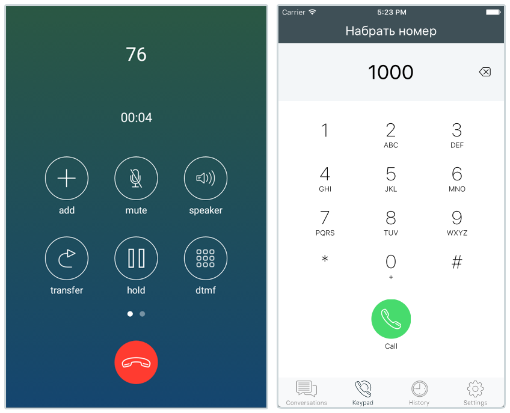

# Open-source React Native SIP client for Android & iOS

Based on [React Native](https://github.com/facebook/react-native) and [ReactNativePJSIP](https://github.com/datso/react-native-pjsip)



# Setup

## 1. Clone the repo:

  ```
  $ git clone https://github.com/tariq86/rn-sip-app
  $ cd rn-sip-app
  ```

## 2. Install dependencies:

  ```
  $ npm install
  ```

## 2.1 _(Optional - iOS only)_ Fix warnings
If you want to fix the yellow warnings that pop up when first opening the app, you'll need to perform the following module edits in XCode:

#### RNCallKit Module
 1. In the Project Navigator, open `Libraries` > `RNCallKit.xcodeproj` > `RNCallKit` > `RNCallKit.m`
 1. Add the following code right after the close of the `(instancetype)init` function closing bracket (around line 52):
 ```
+ (BOOL)requiresMainQueueSetup
{
    return NO;
}
 ```

##### Note: This change requires a full recompile of the app, so you will need to re-run the `npm run ios` command if the app is already running

## 3. Running on Android:
To run on Android, you can run either `npm run android` (recommended) _or_ `react-native run-android` from the project root directory.

##### Note: I haven't tested on Android yet, so I cannot guarantee that it works!

## 4. Running on iOS:
To run on iOS, you can call either `npm run ios` (recommended) _or_ `react-native run-ios`  from the project root directory.

##### Note: I have only tested on an iPhone XS Emulator running 12.1, compiled using XCode version 10.2.
